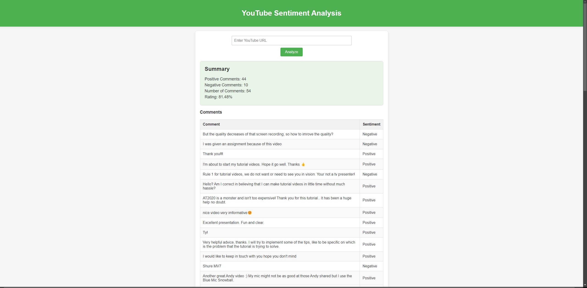

# YouTube Sentiment Analysis

## Overview

This project involves sentiment analysis of YouTube comments using various
machine learning models, including Word2Vec-based models and
fine-tuned DistilBERT. The goal is to classify comments as either
Positive or Negative and display video rating in percentage. The project includes:

- Training models using Word2Vec embeddings with Random Forest, Logistic Regression, and SVM.
- Fine-tuning DistilBERT for better performance on the sentiment classification task.
- A Flask server that allows users to input YouTube video links, analyzes the comments using the trained models, and displays results in an HTML frontend.

## Table of Contents

1. [Features](#features)
2. [Setup](#setup)
3. [Usage](#usage)
4. [Data Preparation](#data-preparation)
5. [Model Training Details](#model-training-details)
6. [Flask Server Details](#flask-server-detail)
7. [Contributing](#contributing)


## Features

- **Model Training**:
  - Train Random Forest, Logistic Regression, and SVM models using Word2Vec embeddings.
  - Fine-tune DistilBERT on a sentiment analysis dataset.
- **Sentiment Classification**:
  - Predict sentiment of YouTube comments using trained models.
- **Flask Web Application**:
  - Input YouTube video links, analyze comments, and display results.

## Setup

### Prerequisites

- Python 3.7+
- PyTorch
- Transformers
- Gensim
- Flask
- scikit-learn
- Pandas
- Requests
- Numpy 
- Google-api-python-client

### Installation

1. Clone the repository:

   ```bash
   git clone https://github.com/yourusername/your-repo.git
   cd your-repo
   ```
2. Create and activate a virtual environment:
   
   ```bash
   python -m venv .venv
   source .venv/bin/activate  # On Windows use: .venv\Scripts\activate
   ```
3. Install required packages

   ```bash
   pip install -r requirements.txt
   ```
4. Download the Google News Word2Vec embeddings:
   * Download from [Google News Word2Vec](https://www.kaggle.com/datasets/adarshsng/googlenewsvectors)
   * Place the 'GoogleNew-vectors-negative300.bin' file in the project directory

5. Set Up Youtube API:

    To enable Youtube data access for comment analysis:
    1. Go to the Google Cloud Console
   2. Create a new project or select an existing project.
   3. Navigate to 'APIs & Services'
   4. Click on ENABLE APIS AND SERVICES
   5. Search for 'YouTube Data API v3'
   6. Click on Enable
   7. Navigate to 'Credentials'
   8. Click on 'Create Credentials' and select 'API Key'
   9. Save your API Key securely; you will need it to interact with YouTube API.
   10. Create .env file in the root project directory and add this line:
       ```bash
       YOUTUBE_API_KEY=your_api_key_here
       ```

## Usage

### Model Training

1. Train Models:

    Run the following script to train and evaluate Random Forest, 
    Logistic Regression and SVM models using Word2Vec embeddings:

   ```bash
   python word2vec_models.py
   ```
    This script will create and save the models('random_forest_model.pkl',
    'logistic_regression_model.pkl', 'svm_model.pkl') and display performance metrics.


2. Fine-Tune DistilBERT:

    Run the following script to fine-tune DistilBERT on the [dataset](https://www.kaggle.com/datasets/kazanova/sentiment140?resource=download):

   ```bash
   python distilbert_model.py
   ```

    This script will save the best fine-tuned DistilBERT model as 
    'distilbert_model_best.pth'.


3.  Choosing model:
    
    You can modify app/predict.py file to use preferred model.
    Since DistilBert gives best results, that is the default one 
    selected for analysis. Fine tuned DistilBert model is available to 
    download from [here](https://drive.google.com/file/d/1ayfGi46vXjKR_cmdDOsk4qmmZeG8ORwA/view?usp=sharing).
    You can then place it to models directory as instructed to use it. 


4.  Any additional needed help can be found as comments in code.


### Flask Server

1. Run Flask Server:

    Start the Flask server:
    ```bash
    python app/server.py
    ```
   
    The server will be accessible at 'http://localhost:5000'. 
    Use the frontend to input Youtube video links and analyze comments.
    Here is a screenshot of the Flask app displaying the sentiment analysis results:
    

## Data Preparation

If your dataset is too large to handle, you can use the following script to downsample it to a
    balanced dataset with equal class distribution:

1. Util/downsample_dataset.py

    Run the following script to create a balanced downsampled dataset
   (entered value represents desired number of examples per class, 
    default is 50000, whole dataset contains around 650000 examples per class):
    ```bash
   python util/downsample_dataset.py --downsample-size ENTER_YOUR_VALUE
    ```
   
    This script will downsample the dataset to desired size and save 
    it to 'data/balanced_downsampled_data.csv'. 

## Model Training Details

### Word2Vec-Based Models

*   Training: 
    * Use the Word2Vec embeddings to train Random Forest, Logistic Regression, and SVM models.
    * Models are evaluated based on accuracy, precision, recall and f1-score and saved.

### Fine-Tuning DistilBert

* Training:
    * Fine-tune DistilBERT with custom sentiment analysis dataset.
    * Implements early stopping, learning rate scheduler and saves the best model.
    * Has built in command line interface to interact and test the model with input text.

## Flask Server Detail

* Frontend:
    * A simple HTML interface to input YouTube video links and display results

* Backend: 
    * Analyzes comments using the trained models and returns results.

## Results

In this YouTube Comments Sentiment Analysis project, different models with varying complexities were employed to classify comments as positive or negative:

*  **Word2Vec Based Models** (Random Forest, Logistic Regression, SVM):
   * Complexity: These models are relatively simple and quick to train. They use Word2Vec embeddings to represent words as vectors, which are then fed into traditional machine learning algorithms.
   * Accuracy: While these models are effective for many tasks, their simplicity means they may miss out on capturing the nuanced language used in YouTube comments. This can lead to lower accuracy, especially on comments with subtle sentiment cues.


*  **DistilBERT**:

   * Complexity: DistilBERT is a pre-trained transformer model fine-tuned for this specific task. Its architecture allows it to capture more complex patterns and contextual information in the comments.
   * Accuracy: Due to its ability to understand context better than simpler models, DistilBERT generally achieves higher accuracy. However, this comes at the cost of increased computational requirements, longer training times, and a higher risk of overfitting.

Potential improvements: 
*  **Dataset Augmentation**: Improving the dataset by increasing its size or adding more diverse examples, particularly for DistilBERT, could enhance model performance. A more varied dataset would help the model generalize better to new, unseen comments.

*  **Advanced Techniques for Word2Vec Models**: For the simpler models, experimenting with techniques like TF-IDF weighting, using different embeddings, or tuning hyperparameters could boost their accuracy, making them more competitive with complex models like DistilBERT.

By carefully balancing these tradeoffs and exploring improvements, the models in this project can be optimized for both performance and efficiency, depending on the specific requirements of the application.

Evaluation metrics are saved in model outputs directory. 

## Contributing

I encourage you to open issues or submit pull requests. Contributions to improve
functionality and performance are always welcome :)